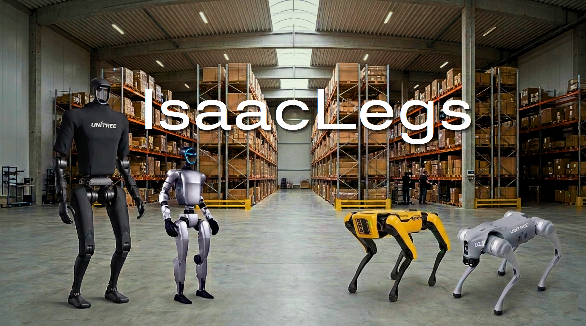
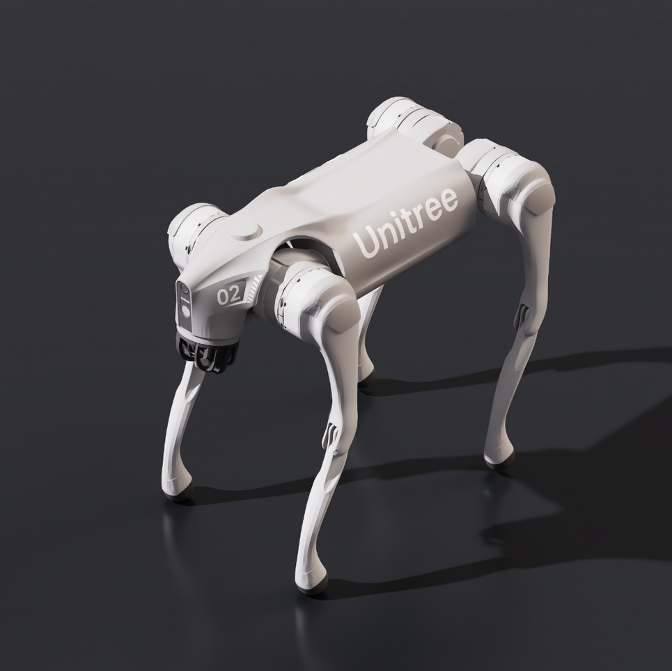
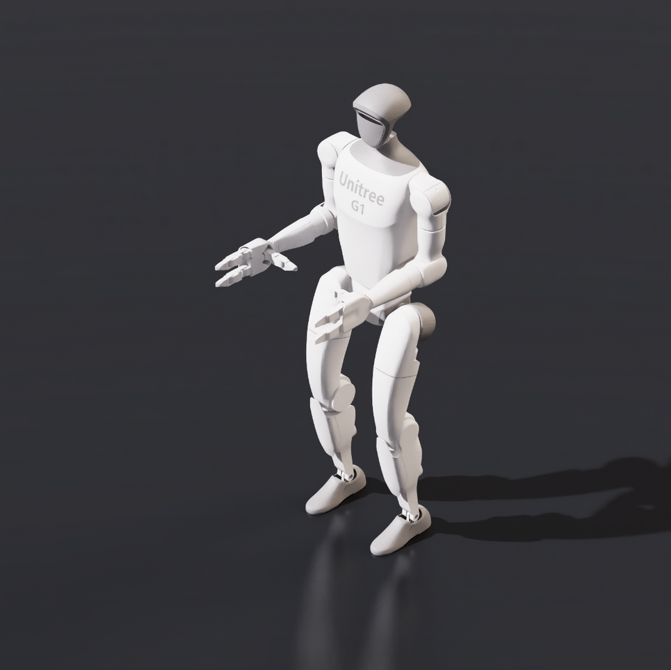
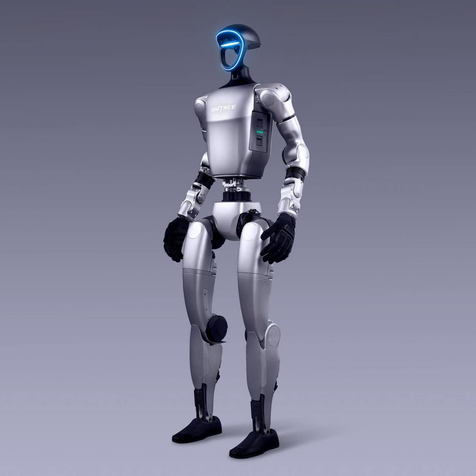
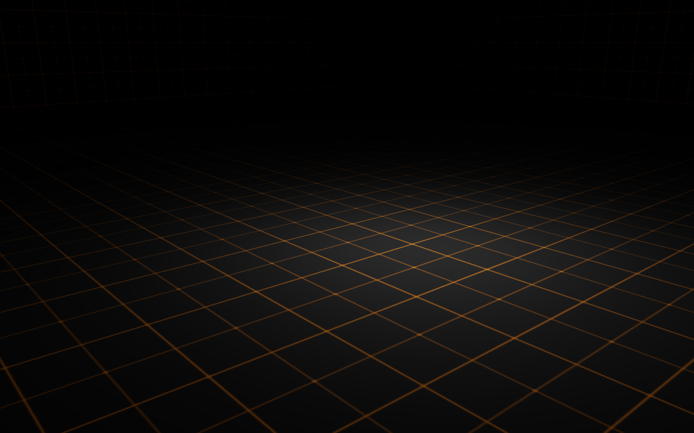
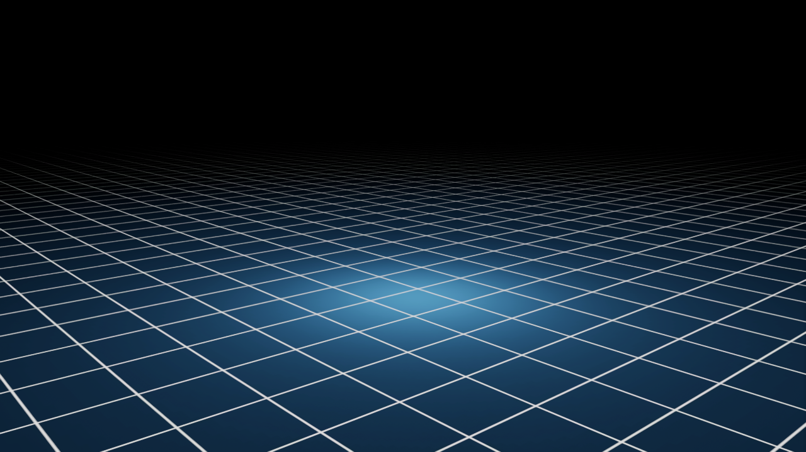
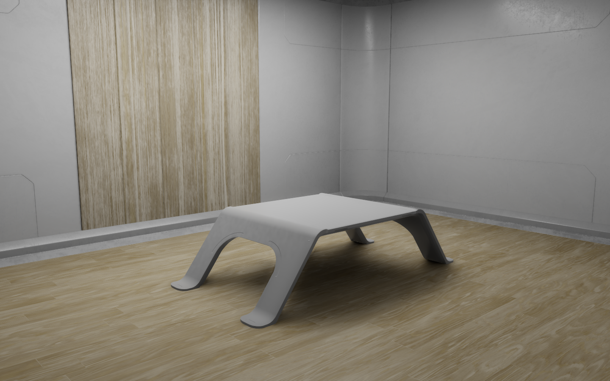
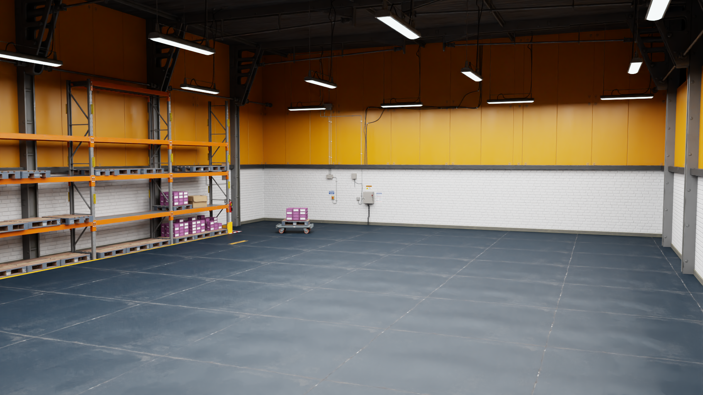
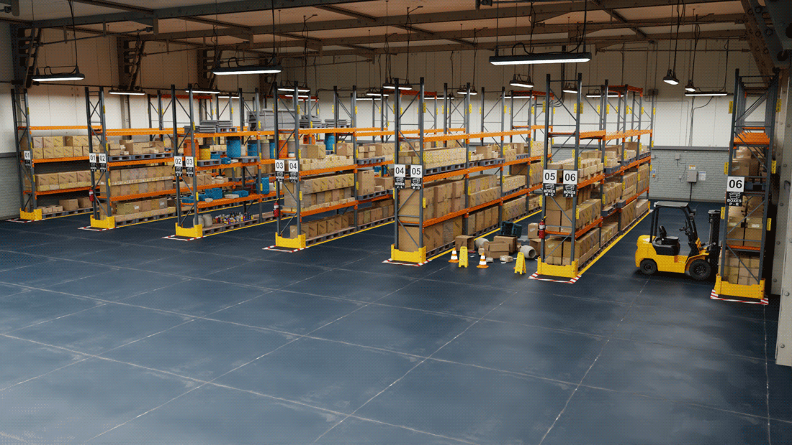

# IsaacLegs

A reinforcement-learning and deployment pipeline for legged robots, built on NVIDIA Isaac Lab, Isaac Sim, and ROS 2.


<!-- MEDIA: docs/assets/hero.gif — the policy_controller node walking the G1 and the Go2,
     ideally one shot inside the warehouse environment. -->


IsaacLegs facilitates the deployment of policies trained in Isaac Lab onto robots inside the Isaac Sim digital twin using ROS. It currently supports the Unitree Go2 quadruped and the Unitree G1 humanoid, including a 29-DOF configuration, with additional robots coming soon.

The framework provides ready-to-use digital twins that integrate robot state, sensor streams, and control interfaces within Isaac Sim, with support for creating custom digital twins for additional robot platforms. Robots can be deployed into a variety of NVIDIA simulation environments, referenced from Isaac Asset or Custom Environments.

The controller is designed to work with different robot platforms through ROS 2 interfaces, making it easy to support additional robots, sensors, and policies.

---

## Gallery

Policies trained in Isaac Lab, and deployed in Isaac Sim digital twins across different
environments. 

<table>
  <tr>
    <td align="center" width="50%">
      <br>
      <b>Go2 — Warehouse</b><br>
      <!-- <sub>Quadruped locomotion through a stock NVIDIA warehouse</sub> -->
    </td>
    <td align="center" width="50%">
      <br>
      <b>G1 — Flat ground</b><br>
      <!-- <sub>Humanoid locomotion on a flat plane</sub> -->
    </td>
  </tr>
  <tr>
    <td align="center" width="50%">
      <br>
      <b>G1 (29-DOF) — Simple room</b><br>
      <!-- <sub>Onboard LiDAR streamed over ROS 2</sub> -->
    </td>
    <td align="center" width="50%">
      <br>
      <b>Go2 — Camera + 3D LiDAR in RViz</b><br>
      <!-- <sub>Onboard 2D camera and 3D LiDAR visualized in RViz</sub> -->
    </td>
  </tr>
</table>

---

## Requirements

| Component | Version | Notes |
|---|---|---|
| Ubuntu | 22.04 | |
| [Isaac Sim](https://docs.isaacsim.omniverse.nvidia.com/5.0.0/installation/quick-install.html) | ≥ 5.0.0 | the simulator and digital-twin runtime |
| [Isaac Lab](https://isaac-sim.github.io/IsaacLab/main/source/setup/installation/pip_installation.html) | ≥ 0.46.2 | needed only to train policies — its pip install also pulls in Isaac Sim |
| [ROS 2](https://docs.ros.org/en/humble/Installation.html) | Humble | |
| Python | 3.10 | |

> A CUDA-capable NVIDIA GPU is required for Isaac Sim.

---

## Getting started

A complete run consists of the **digital twin** in Isaac Sim and the **policy controller** in ROS 2. The steps below take you from a fresh clone to a walking robot.


### 1. Clone and build the workspace

```bash
git clone https://github.com/gholibqasobov/IsaacLegs.git ~/IsaacLegs
cd ~/IsaacLegs
colcon build --symlink-install
source install/setup.bash          # re-run in every new shell
```

### 2. Launch a digital twin

`launch_scene.py` opens the Isaac Sim GUI with a ready-to-run robot and environment. Run the script from the Isaac Sim Python environment using the option that matches your installation:

**If you have a conda with IsaacSim/IaacLab installed:**

```bash
conda activate env_isaaclab
cd ~/IsaacLegs
python isaacsim_envs/gui/launch_scene.py --go2 --warehouse --play
```

**Or use Isaac Sim's bundled interpreter** (`python.sh`):

```bash
cd ~/IsaacLegs
~/isaacsim/python.sh isaacsim_envs/gui/launch_scene.py --go2 --warehouse --play
```

> Adjust ~/isaacsim to match your Isaac Sim installation path. The same approach applies to all other Isaac Sim scripts.

**Options.** Pick one robot, optionally one environment, plus any run flags — e.g. `--go2 --warehouse --play`.

- **Robot**: `--go2` · `--g1` · `--g1_29dof`
- **Environment**: `--flat_grid` · `--flat_plane` · `--rough_plane` · `--simple_room` · `--warehouse` · `--full_warehouse`
- `--play` — start simulating immediately; Otherwise press **▶ Play** in the GUI. 
- `--headless` — run without a GUI window.
- `--list` — print the available scenes and environments, then exit.

See [Supported robots & environments](#supported-robots--environments) for previews and details.

### 3. Run the policy controller

In a second terminal (with the workspace sourced):

```bash
ros2 launch fullbody_controller go2.launch.py     # also: g1.launch.py, g1_29dof.launch.py
```

> **Start order matters for humanoids.** A G1 will fall in the moments before the policy engages.
> Launch the scene **without** `--play`, start the controller, then press **▶ Play** — or start
> the controller first and launch with `--play`. Quadrupeds (Go2) are forgiving either way.

**Parameters** (`-p name:=value` on `ros2 run`, or `name:=value` on `ros2 launch`):

- `policy_path` — path to the TorchScript policy (`.pt`); defaults to the shipped checkpoint.
- `io_descriptors_path` — override the descriptor location (default: next to the policy).
- `decimation` *(default `1`)* — run the policy every Nth tick (50 Hz sensors → 50 Hz control at 1).
- `warmup_sec` *(default `0.0`)* — seconds spent easing into the policy's default pose before engaging it.
- `warmup_interpolate` *(default `True`)* — interpolate from the spawn pose to default (no violent snap).

### 4. Command and inspect the robot

Drive it by publishing a velocity, or interactively from the keyboard:

```bash
ros2 run teleop_twist_keyboard teleop_twist_keyboard
# or
ros2 topic pub /cmd_vel geometry_msgs/msg/Twist "{linear: {x: 0.3}, angular: {z: 0.3}}" -r 10
```

Inspect what's flowing over ROS 2:

```bash
ros2 topic list
ros2 topic echo /joint_states
```

<!-- For the G1, an RViz configuration is provided at -->
<!-- [`src/robots/g1_description/rviz/g1.rviz`](src/robots/g1_description/rviz/g1.rviz). -->

<!-- MEDIA: docs/assets/rviz.png — RViz showing the G1 robot model + sensor data. -->

---

## Supported robots & environments

### Currently Available Robots

<!-- MEDIA: docs/assets/robot_go2.png, robot_g1.png, robot_g1_29dof.png — a clean still of each robot. -->

| Preview | Robot | Flag | Policy directory |
|:---:|---|:---:|---|
|  | **Unitree Go2** — quadruped | `--go2` | `policy/go2_locomotion` |
|  | **Unitree G1** — humanoid | `--g1` | `policy/g1_locomotion` |
|  | **Unitree G1 29-DOF** — humanoid | `--g1_29dof` | `policy/g1_29dof_locomotion` |

> Policy directories are under `src/fullbody_controller/policy/`

### Sample Stock Environments 
| Preview | Environment | Flag |
|:---:|---|:---:|
|  | Flat grid | `--flat_grid` |
|  | Flat plane | `--flat_plane` |
|  | Simple room | `--simple_room` |
|  | Warehouse | `--warehouse` |
|  | Full warehouse | `--full_warehouse` |

Adding a stock world is a one-line edit to the `ENVIRONMENTS` dict in
[`launch_scene.py`](isaacsim_envs/gui/launch_scene.py):

```python
ENVIRONMENTS = {
    # ...
    "my_world": "/Isaac/Environments/.../my_world.usd",
}
```

## ROS 2 topics. 

Published by the simulation (action graphs):

| Topic | Type |
|---|---|
| `joint_states` | `sensor_msgs/JointState` | 
| `joint_command` | `sensor_msgs/JointState`| 
| `imu` | `sensor_msgs/Imu` | 
| `odom` | `nav_msgs/Odometry` | 
| `clock` | `rosgraph_msgs/Clock` |
| `/rgb`, `/depth` | `sensor_msgs/Image` | 
| `/scan`, `/point_cloud` | `sensor_msgs/{LaserScan,PointCloud2}` | 
---

<!-- ## Guides

- [How to train a policy](docs/training.md) — train in Isaac Lab and export the deployable artifacts.
- [How to create a digital twin](docs/digital_twin.md) — import the robot, set drive gains, wire the ROS 2 action graphs.
- [How to use the policy controller for a custom robot](docs/custom_robot_controller.md) — the `IO_descriptors` contract, the extension points, adding sensors. -->

---

<!-- ## Roadmap

- `standalone_ros` and `standalone_direct` deployment modes (scripted/headless sim, and
  in-process inference without ROS).
- RViz configuration for the Go2.
- More robots and environments. -->

## Contributing & feedback

If IsaacLegs is useful to you, please consider giving it a ⭐ — it helps others find the project
and motivates further development. Found a bug, have a feature in mind, or want a new robot or
environment supported? [Open an issue](https://github.com/gholibqasobov/IsaacLegs/issues) or
start a discussion — feedback and contributions are very welcome.

---

## License

Apache-2.0. See individual package headers.

## Acknowledgements

NVIDIA Isaac Lab and Isaac Sim, Unitree Robotics, and the RSL-RL project.
