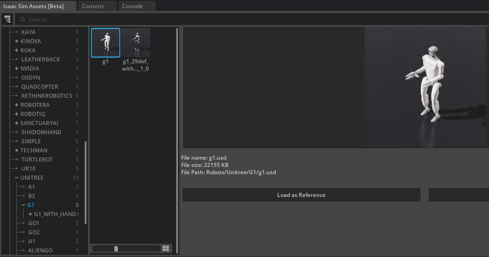
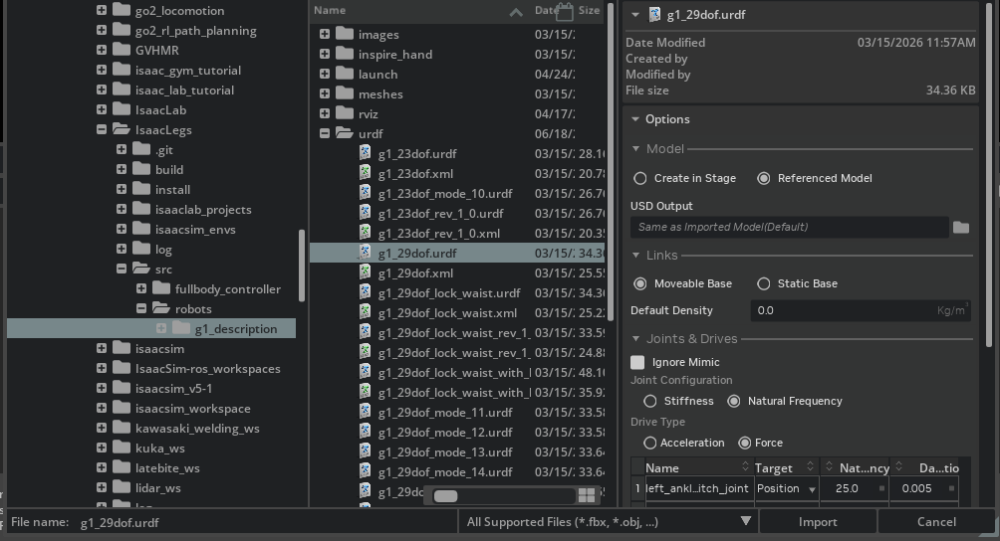
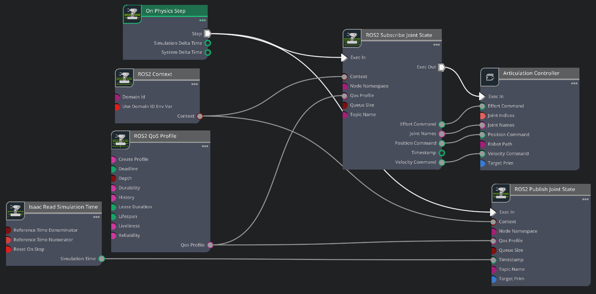
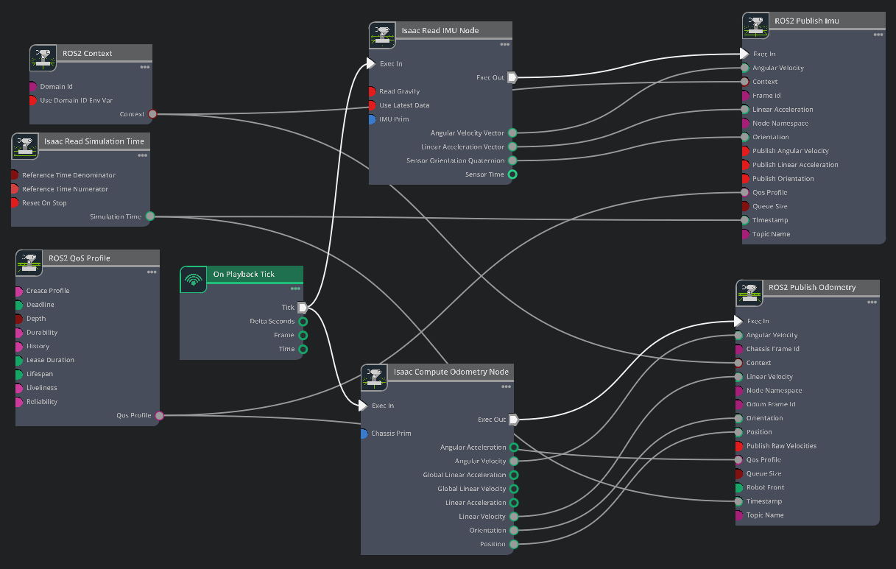
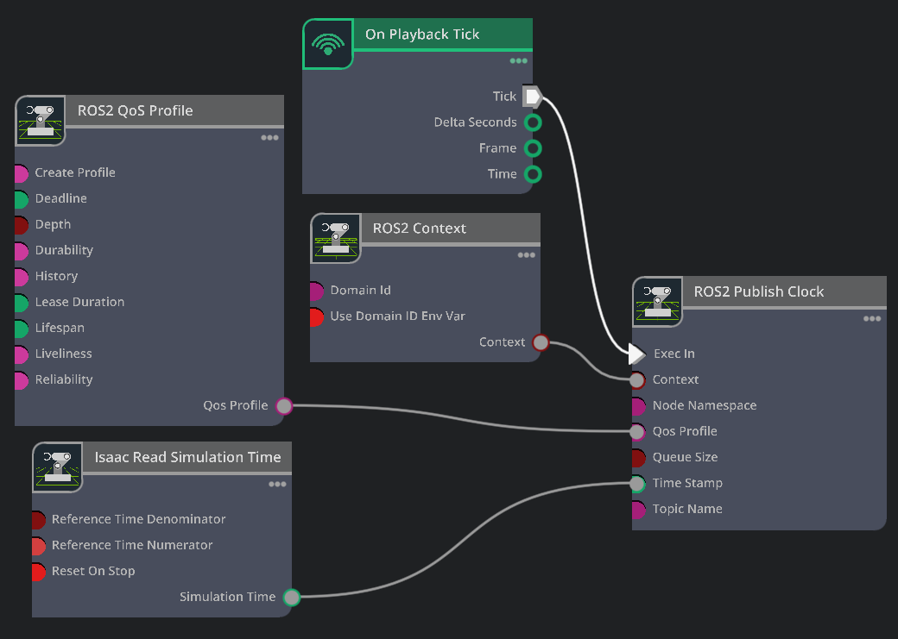

# How to create a digital twin in Isaac Sim

This guide describes how to create and configure a digital twin for use with IsaacLegs. It covers the components required for robot integration and ROS 2 communication in Isaac Sim. Existing robot scenes can be used as references when creating a digital twin for a new platform.

← [Back to the Training a Policy](training.md) 

NVIDIA's official tutorial covers this same end-to-end setup and is a useful companion reference:

> **[Isaac Sim — ROS 2 RL controller tutorial](https://docs.isaacsim.omniverse.nvidia.com/6.0.0/ros2_tutorials/tutorial_ros2_rl_controller.html)**

---

## Prerequisite

A trained policy copied into `src/fullbody_controller/policy/<project>/` (see
[training](training.md)), **or** one of the policies already shipped there.

> All `isaacsim_envs/gui/*.py` scripts run **inside the Isaac Sim Python environment** (e.g.
> `conda activate env_isaaclab`, or `~/isaacsim/python.sh`).

---

## 1. Import the robot

There are two ways to get the robot onto the stage.

**From the Isaac Sim asset library** — if the robot is available in the Isaac Sim asset library, it can be added directly to the stage from the asset browser.



**From a URDF** — use the **URDF Importer** to bring in your own robot description. 

This repo ships
some robot descriptions under [`src/robots/`](../src/robots/). Additional robot platforms will be added over time.

> **Set the robot base as movable**



Place the robot under `/World/<robot>` and save the scene as `isaacsim_envs/gui/<robot>.usd` so
`launch_scene.py` auto-discovers it as a `--<robot>` flag.

---

## 2. Apply the trained drive gains with `setup_robot_gains.py`

A policy assumes the same joint stiffness, damping, effort limits, and initial pose used during training. Instead of setting these values manually, `setup_robot_gains.py` reads them from the exported YAML files and applies them to the robot articulation.

| Source | Provides |
|---|---|
| `IO_descriptors.yaml` | per-joint stiffness (kp), damping (kd), armature, default pose |
| `env.yaml` | effort limit |

Isaac Sim’s **Script Editor** does not accept command-line arguments. The setup selection is saved once from the terminal into `~/.isaaclegs_setup_gains.json`, then executed manually in the **Script Editor**.

```bash
# 1. From a terminal — record which policy + which robot prim to configure (G1 example)
python isaacsim_envs/gui/setup_robot_gains.py src/fullbody_controller/policy/g1_locomotion /World/g1

# the robot prim is normalized — "g1", "/g1" and "/World/g1" all resolve to /World/g1
```

Start the simulation, then go to **Windows → Script Editor → Open File** and open `setup_robot_gains.py` from `isaacsim_envs/gui/`. Ensure the simulation is running, click **Run** once, and the robot will move to its initial position. A `DONE` message confirms successful setup. 

The script reads the sidecar file, applies joint gains (kp, kd), armature, and effort limits in the correct DOF order, sets the default joint pose, and prints a per-joint summary.


To reset the previously saved setup choice, run the command below. This removes the stored configuration so the setup process can be repeated from scratch.
<!-- MEDIA: docs/assets/setup_gains_terminal.png — the terminal sidecar command + the Script
     Editor "Run" output table (joint  kp  kd  eff  arm  init). -->

```bash
# To reset the saved choice:
python isaacsim_envs/gui/setup_robot_gains.py clear
```

> If no sidecar exists, the script falls back to built-in G1 defaults.

---

## 3. Wire the ROS 2 action graphs

ROS 2 communication in Isaac Sim is implemented through OmniGraph action graphs. **OmniGraph Action Graphs** are event-driven, node-based visual scripting graphs used in NVIDIA Omniverse.   The G1 scene wires at least three graphs, built below.

Create each graph with **Window → Graph Editors → Action Graph → New Action Graph**. The wiring
follows NVIDIA's [ROS 2 RL controller tutorial](https://docs.isaacsim.omniverse.nvidia.com/6.0.0/ros2_tutorials/tutorial_ros2_rl_controller.html);
the steps below adapt it to the G1 (robot prim `/World/g1`).


### Joint states + joint command

Publishes the current joint positions/velocities on `joint_states`, and subscribes to
`joint_command` (the policy's target positions), feeding an *Articulation Controller* that drives the
joints.



1. Add **On Physics step**, **ROS2 Context**, **ROS2 QoS Profile** and **Isaac Read Simulation Time**.
2. Add **ROS2 Publish Joint State** — set *Target Prim* = `/World/g1`, *Topic* = `joint_states`.
   Wire the tick, QoS, context, and timestamp into it.
3. Add **ROS2 Subscribe Joint State** — set *Topic* = `joint_command`. Wire the tick, QoS, and context
   into it.
4. Add an **Articulation Controller** — set *Target Prim* = `/World/g1`. Wire the subscriber's
   `Exec Out → Exec In`, and its joint outputs (`jointNames`, `positionCommand`) into the matching
   Articulation Controller inputs.

### IMU + odometry

Publishes the body IMU on `imu` and the base pose/twist on `odom`.



1. Add **On Playback Tick**, **ROS2 Context**, **ROS2 QoS Profile** and **Isaac Read Simulation Time**.
2. Add **Isaac Read IMU Node** — set *IMU Prim* to the IMU sensor on the base (e.g.
   `/World/g1/pelvis/Imu_Sensor`). **Uncheck *Read Gravity*** so the reading matches the convention
   the policy trained with.
3. Add **ROS2 Publish IMU** — wire the tick, QoS, context, and timestamp, plus the Read IMU outputs
   (linear acceleration, angular velocity, orientation). Set *Topic* = `imu`.
4. Add **Isaac Compute Odometry Node** — set *Chassis Prim* = `/World/g1`.
5. Add **ROS2 Publish Odometry** — wire the tick, QoS, context, and timestamp, plus the Compute
   Odometry outputs (position, orientation, linear/angular velocity). Set *Topic* = `odom`.

### Clock

Publishes the simulation time on `clock` so `use_sim_time` works downstream.



1. Add **On Playback Tick**, **ROS2 Context**, **ROS2 QoS Profile** and **Isaac Read Simulation Time**.
2. Add **ROS2 Publish Clock** — set *Topic* = `clock`. Wire the tick, QoS, context, and the
   `Read Simulation Time → timeStamp`.

### Other sensors

Cameras, LiDAR, contact sensors, and more are added the same way — drop the matching ROS 2 publisher
node into an action graph and wire it to the tick, context, and timestamp. See NVIDIA's OmniGraph
documentation for the full node reference:

> **[Isaac Sim — OmniGraph documentation](https://docs.isaacsim.omniverse.nvidia.com/6.0.0/omnigraph/index.html)**

---

## 4. Verify the twin

> Enable the **ROS 2 bridge** extension in Isaac Sim (**Window → Extensions**, search for
> `isaacsim.ros2.bridge` and enable it — tick *Autoload* to have it on at every startup). Without it,
> no topics are published even while the timeline plays. `launch_scene.py` enables the bridge for
> you; you only need to do this manually when building a scene from scratch.

> Note: If a flat plane was added for testing (e.g., Create → Environments → Flat Grid), delete it after setup. The environment is created automatically by launch_scene.py

```bash
# Launch with the ROS 2 bridge on and the timeline playing
python isaacsim_envs/gui/launch_scene.py --g1 --flat_plane --play

# In another terminal:
ros2 topic list
ros2 topic echo /joint_states --once
```


---

## Next →

[**Use the policy controller to drive your robot**](custom_robot_controller.md)
